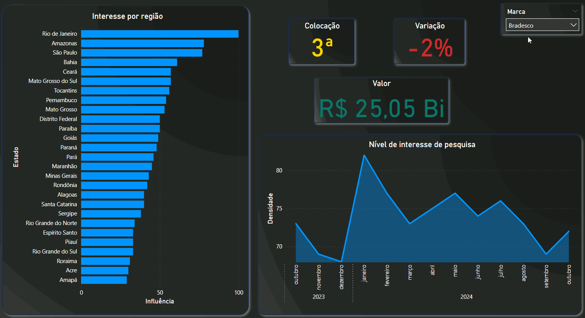

# Análise de tendências de marcas do Brasil

O projeto é uma automação que utiliza Selenium para explorar as tendências de marcas brasileiras mais valiosas, de acordo com o [Brand Finance](https://exame.com/marketing/as-100-marcas-brasileiras-mais-valiosas-totalizam-r-392-bilhoes-confira-ranking/), no Google Trends. O objetivo é buscar e baixar dados de pesquisa das marcas, facilitando a análise de suas popularidades no Brasil.

## Funcionalidades: 

* Pesquisa por marcas no Google Trends.
* Download automático de arquivos CSV com dados de tendências.
* Renomeação dos arquivos baixados com o nome da marca correspondente.
* Armazenamento dos arquivos em uma pasta específica chamada "dados".
* Apresentação dos dados em um dashboard no Power BI

## Pré-requisitos

* Python
* Selenium
* Pandas
* WebDriver do Chrome

## Dashboard

